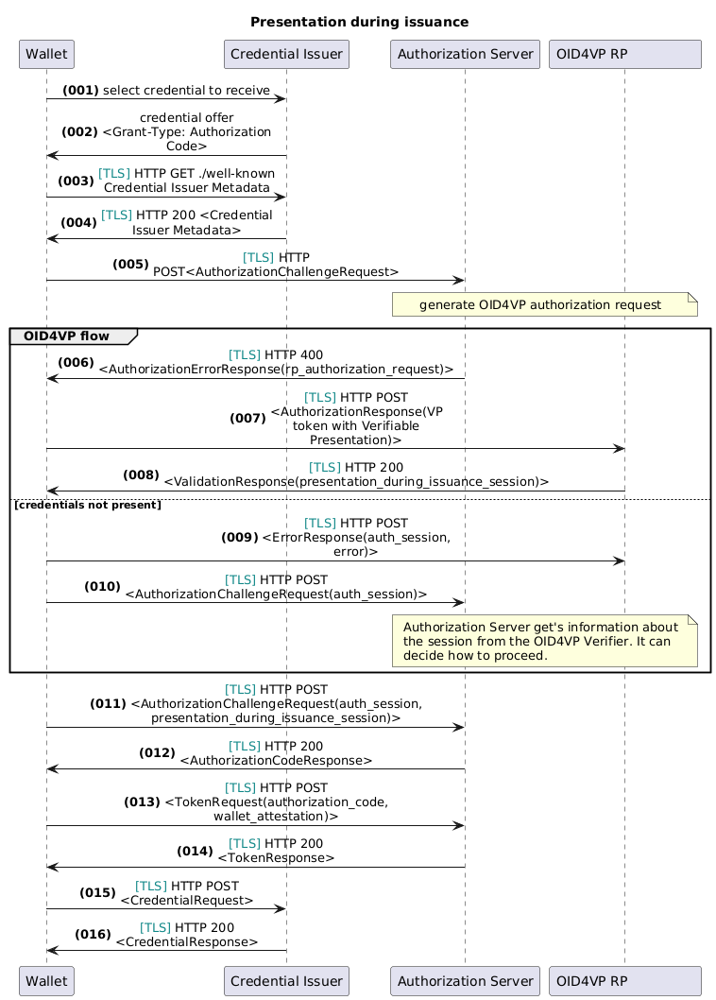
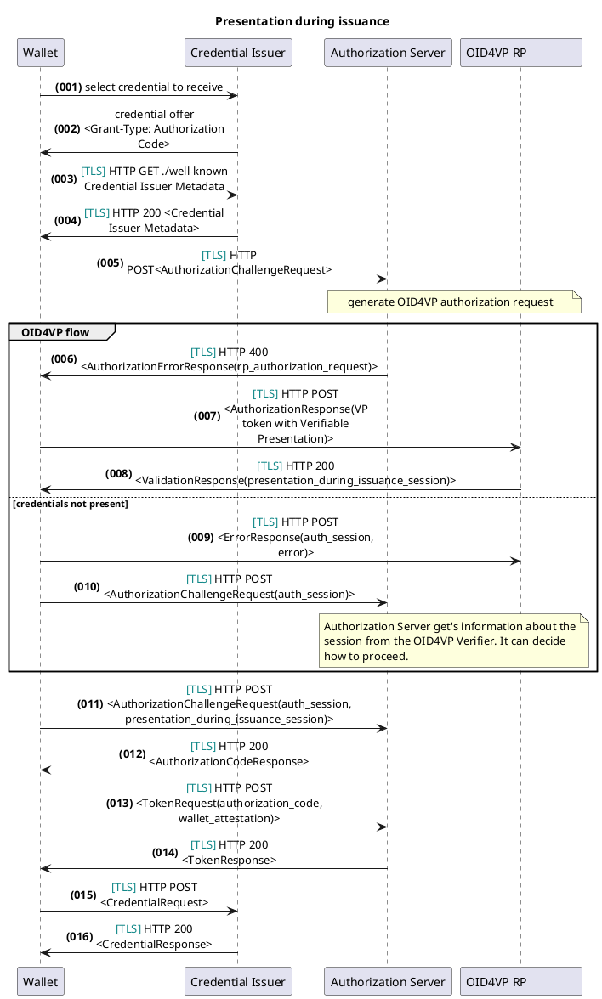

# Presentation during Issuance

An issuer might want to request the presentation of the credential(s)
as a means to authenticate the user during the issuance of another credential.
This document refers to and extends [dynamic credential
request](https://openid.net/specs/openid-4-verifiable-credential-issuance-1_0.html#name-dynamic-credential-request)
in OID4VCI with [OAuth 2.0 for First-Party
Applications](https://www.ietf.org/archive/id/draft-parecki-oauth-first-party-apps-02.html).
It is leveraging the Authorization code flow to improve the user experience with a browser-less approach.

The flow is described below, focusing only on the key components relevant to this process:





## Step-by-Step Description

1. The Wallet chooses a credential to receive.
2. The Credential Issuer may send a credential offer to the Wallet.
3. The Wallet acquires the Credential Issuer's metadata.
4. The Credential Issuer responds with the required metadata.
5. The Wallet submits an Authorization Challenge Request to the Issuer's Authorization Server using HTTP POST.
6. The Issuer checks if enough information is available to authorize credential issuance. If not, it sends a
   presentation request to the Wallet via an Authorization Challenge Error Response.
7. If the Wallet provides the required credential, it submits an authorization request to the RP.
8. If the Wallet cannot provide the credentials:
    - It sends an error response, including the state information (auth_session), to the RP.
    - It then resubmits the authorization challenge to the Issuer’s Authorization Server, including the session state.
9. The Issuer decides how to proceed (e.g., generating a new presentation request or issuing a redirect).
10. The RP processes the response and provides status information back to the Wallet.
11. The Wallet uses this response to resubmit the authorization challenge to the Issuer.
12. The Issuer validates the request and issues an authorization code if successful.
13. The Wallet exchanges the authorization code for an access token from the Token Endpoint.
14. The Authorization Server provides the Token Response.
15. The Wallet requests the credential from the Issuer.
16. The Issuer delivers the credential to the Wallet.

## Known limitations

This flow is based on the "OAuth 2.0 for First-Party Applications" draft, and
aims for a browser-less approach to improve user experience. This comes with the
limitation that the credential presentation request is handled by the same
Wallet that was used to start the OID4VCI process.
If credentials are stored in other wallets there currently is no solution to remedy the situation.

## Changes to the OID4VC Flow

With the usage of the first party application flow, the issuer metadata need to
be extended with the
[authorization_challenge_endpoint](https://www.ietf.org/archive/id/draft-parecki-oauth-first-party-apps-02.html#name-authorization-server-metada).

This value needs to point to the agent's `authorization_challenge_endpoint`. You put the value in the `oid4vci_metadata`
folder, as part of the OID4VCI issuer metadata.

Since the OID4VCI flow includes an authorization flow, the lifetime of the
session has to be increased.

### Additional parameters

The following parameters are defined in this flow and are not part of the normal
OID4VCI or first party app specifications:

#### auth_session

REQUIRED. The auth session allows the authorization server to associate
subsequent requests by this client with an ongoing authorization request
sequence. The client MUST include the auth_session in follow-up requests to the
authorization challenge endpoint if it receives one along with the error
response.

#### presentation

REQUIRED. String containing the OID4VP request URI. The Wallet will use this URI
to start the OID4VP flow.

#### presentation_during_issuance_session

OPTIONAL. String containing information about the session when credential
presentation is happening during issuance of another credential. The content of
this parameter is opaque to the wallet. When this parameter is present the
Wallet MUST use this parameter in the subsequent Authorization Challenge
Request. This allows the Issuer to determine which it can be used by to prevent
session fixation attacks. The Response URI MAY return this parameter in response
to successful Authorization Responses or for Error Responses.

## Appendix: Examples

### Example Authorization Challenge Request

Extend the request with the [authorization details
parameter](https://openid.github.io/OpenID4VCI/openid-4-verifiable-credential-issuance-wg-draft.html#name-using-authorization-details)
or the
[scope](https://openid.github.io/OpenID4VCI/openid-4-verifiable-credential-issuance-wg-draft.html#name-using-scope-parameter-to-re).
The `request_uri`, `code_challenge`, `code_challenge_method`, `response_type`
authorization request parameters MUST NOT be provided.

```http
POST /authorize-challenge HTTP/1.1
Host: server.example.com
Content-Type: application/x-www-form-urlencoded

client_id=example.client.id
```

### Example Authorization Error Response

```http
HTTP/1.1 400 OK
Content-Type: application/json
Cache-Control: no-store

{
  "error": "insufficient_authorization",
  "auth_session": "123456789",
  "presentation": "/authorize?client_id=..&request_uri=https://rp.example.com/oidc/request/1234"
}
```

### Example Validation Response

```http
HTTP/1.1 200 OK
Content-Type: application/json
Cache-Control: no-store

{
  "presentation_during_issuance_session": "eyJenciPiJITzI4iiIsInR5c6IzjX..."
}
```

### Example Error Response

Sending a request according to the
[spec](https://openid.net/specs/openid-4-verifiable-presentations-1_0.html#section-6.4-8)

```http
POST /authorize-challenge HTTP/1.1
Host: server.example.com
Content-Type: application/x-www-form-urlencoded
error=access_denied&auth_session=123456789
```

### Example Authorization Challenge Request with session

```http
POST /authorize-challenge HTTP/1.1
Host: server.example.com
Content-Type: application/x-www-form-urlencoded

client_id=example.client.id&auth_session=123456789&presentation_during_issuance_session=eyJenciPiJITzI4iiIsInR5c6IzjX...
```

### Example Authorization Code Response

```http
HTTP/1.1 200 OK
Content-Type: application/json
Cache-Control: no-store

{
  "authorization_code": "uY29tL2F1dGhlbnRpY"
}
```

### Example Token Response

```http
HTTP/1.1 200 OK
Content-Type: application/json
Cache-Control: no-store

{
  "access_token": "2YotnFZFEjr1zCsicMWpAA",
  "token_type": "Bearer",
  "expires_in": 3600,
  "refresh_token": "tGzv3JOkF0XG5Qx2TlKWIA",
  "auth_session": "123456789"
}
```

### Requirements and setup

Currently an issuer instance can support the First party flow. But if configured like that, it cannot support any other
flows, like regular authorization code flows, or pre-authorized_code flows.
The code is prepared to integrate with external Relying Party software conforming to OID4VP, but for now only the
Sphereon OID4VP implementation, exposed as REST APIs is supported. This means that both the OID4VCI and OID4VP
components have to be hosted by Sphereon agents (they could be hosted as separate instances).

Another limitation is that we do not support different presentation definitions per OID4VCI configuration_id yet.
Meaning it now is basically limited to using a single Presentation Definition for all credentials the particular agent
can issue. This will be resolved in Q1 2025.

In order to use the First Party support (OID4VP), you will have to configure either 1 agent that supports both OID4VCI
and OID4VP, or you can opt to host 2 agents, where one is supporting OID4VCI and another OID4VP.